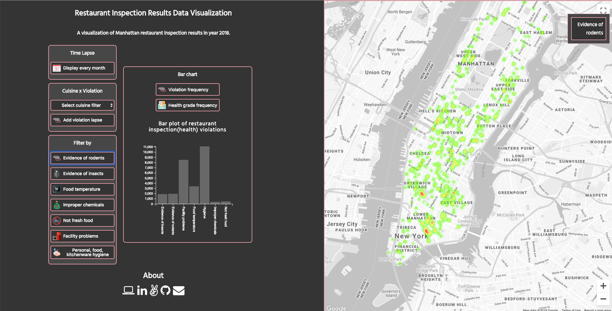

# Restaurant inspection results visualization

[LIVE](http://www.amyskywyl.com/restaurant-inspection-results-visualization/)

### Background

Restaurant's hygene level is really important to people's health, especially for city people who rely on them everyday. Over the past 3 years there has been over 385,000 violations in NYC alone.
This visualization uses DOHMH New York City Restaurant Inspection Results data in Manhattan, 2018 provided by the NYC OpenData to give some insights on the frequency, location and causation of these violations.

### Features  

With this app, users will be able to:
- [ ] Visualize the general pattern of restaurants inspection grade on the heatmap mainly by the score, not just by the density of resturants in a region. I adjusted the weight to affect the intensity so that a location with worse health score will have more red color. A location with grade A (score range 0 - 13) will weight the same.
- [ ] Identify locations where better/worse hygene restaurants clustered
- [ ] Differentiate between violation reasons
- [ ] Identify areas where inspection results improved

### Getting Started

On the left hand side of the screen there is a series of buttons allowing the user to experience the data representation based on various factors. There are three main modes: a dynamic representation, a double filter, a static representation, and a barplot giving more information about the data overall. The dynamic representation is where the data changes over a time frame specified by the control activated. The double filter is a mixture of a dynamic representation and a static representation.
The different controls are:

#### Time Lapse
- [ ] Display every month - displays a time lapse of all of the inspection results graded per month for year 2018
See the gif for Time Laspe:

#### Cuisine x Violation
- [ ] Select cuisine filter - displays the inspection results for the selected cuisine type
- [ ] Add violation lapse - add a violation reason lapse to the cuisine type chosen from the Select cuisine filter button

#### Filter By
- [ ] Evidence of rodents - shows the results caused by mice spotted in facility's food or non-food areas
- [ ] Evidence of insects - shows the results caused by roaches or flies present in facility's food or non-food areas
- [ ] Food temperature - shows the number of results with improper food temperature related violations
- [ ] Improper chemicals - shows the number of results caused by prohibited chemical use, open bait or improper pesticide
- [ ] Not fresh food - displays the data with food adulterated, contaminated, cross-contaminated, or not discarded in accordance with HACCP plan
- [ ] Facility problems - displays the data with problems like toilet or plumbing facility not properly maintained
- [ ] Personal, food, kitchenware hygiene - displays results caused by hygiene problems

#### Bar chart
- [ ] Violation frequency - shows the frequency of each violation reason throughout the entire dataset
- [ ] Health grade frequency - shows the frequency of each health grade throughout the entire dataset

### Screenshot

### Technologies

This project is implemented with the following technologies:

- `JavaScript` for logic
- `D3.js` with `HTML5` for effects rendering
- `Google Maps API` with `Google Heatmap` for effects rendering

